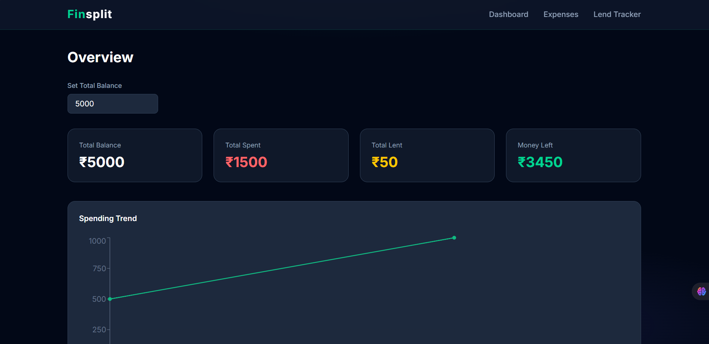
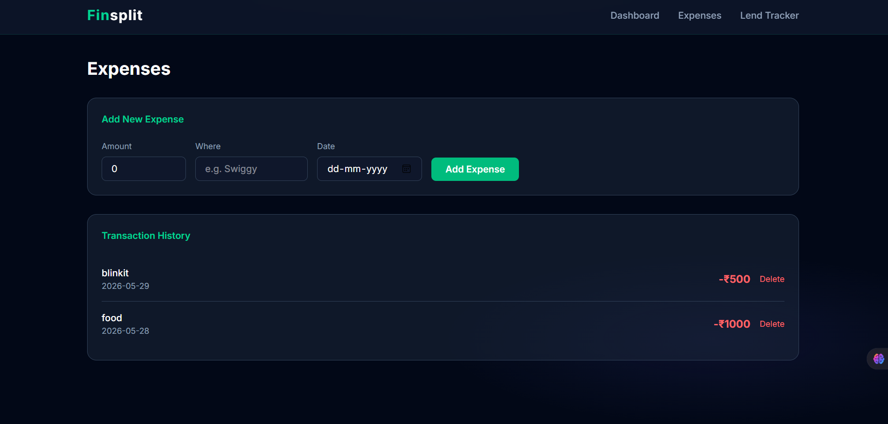
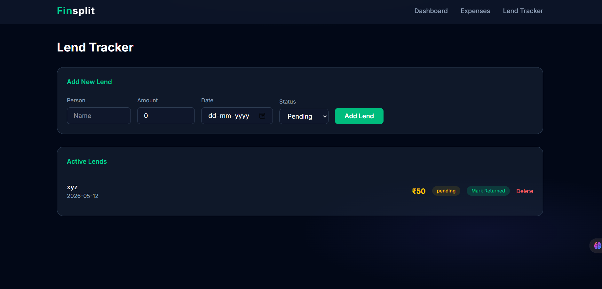

# 💸 Finsplit

A modern personal finance tracker built with React — track expenses, monitor lending, and visualize your spending trends in real time.

🔗 **Live Demo**: [fin-split-ten.vercel.app](https://fin-split-ten.vercel.app/)

---

## Features

- **Dashboard** — Overview of total balance, money spent, money lent, and remaining balance with a live spending trend chart
- **Expense Tracker** — Add, view, and delete expenses with amount, location, and date
- **Lend Tracker** — Track money lent to people, mark as returned, and delete records
- **Persistent Storage** — All data saved to localStorage, survives page refreshes
- **Real-time Calculations** — Balance updates instantly as you add or delete transactions

---

## Tech Stack

- **React** — UI and component architecture
- **React Router DOM** — Client-side routing
- **Context API** — Global state management
- **Recharts** — Spending trend line chart
- **Tailwind CSS** — Styling
- **Vite** — Build tool
- **localStorage** — Data persistence

---

## Getting Started

```bash
# Clone the repo
git clone https://github.com/oorrvii/finsplit.git

# Navigate into the project
cd finsplit

# Install dependencies
npm install

# Start the dev server
npm run dev
```

---

## Project Structure

```
src/
├── components/
│   └── Navbar.jsx
├── context/
│   └── AppContext.jsx
├── pages/
│   ├── Dashboard.jsx
│   ├── Expenses.jsx
│   └── LendTracker.jsx
├── App.jsx
└── main.jsx
```

---

## Screenshots

> Dashboard with spending trend chart and live balance calculations



---

Made with ❤️ by [oorrvii](https://github.com/oorrvii)